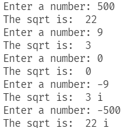

# 算法第一次作业

吕品灏 2052336

## 证明 $gcd(m,n)=gcd(n,m\ mod\ n)$

设 $m>n$ ， $m=kn+c$ ，其中 $k$ 为常数，$c=m\ mod\ n$ ，且 $c\not ={0}$，  
设 $p$ 为 $a,b$ 的一个公约数，将 $c=m-kn$ 两端同时除以 $p$ 之后，得：
$$\frac{c}{p}=\frac{m}{p}-\frac{kn}{p}$$
由等式右边可知， $\frac{c}{p}$ 也是一个整数，
因此， $p$ 是 $n,m\ mod\ n$ 的公约数。  
因其公约数相等，于是最大公约数也相等，得证。

## 计算 $\left\lfloor\sqrt n\right\rfloor$ 的算法  

```Python
while True:
    n=int(input("Enter a number: "))
    if n<0:
        is_negative=True
        n=-n
    else:
        is_negative=False
    left=1
    right=n

    while True:
        result=int((left+right)/2)  # 二分法
        if result*result<=n<(result+1)*(result+1):
            break
        elif result*result>n:
            right=result
        else:
            left=result
    
    if is_negative:
        print("The sqrt is: ",result,"i")
    else:
        print("The sqrt is: ",result)
```

运行截图：  
  

## 证明主定理  

设 $n$ 是 $b$ 的幂，令 $n=b^m$ ,并设 $f(1)=1 ，则
$$f\left(b^m\right)=af\left(b^{m-1}\right)+\left(b^k\right)^m$

累加可得
$$\frac{f\left(b^m\right)}{a^m}=\sum_{i=0}^{m}\left(\frac{b^k}{a}\right)^i$$
移项后，若 $a>b^k$ ，则
$$f(n)=O(a^m)=O(n^{log_ba})$$
若 $a=b^k$ ，则
$$f(n)=O(a^m{log_bn})=O(n^k{logn})$$
若 $a<b^k$ ，则  
$$f\left(n\right)=\frac{\left(\frac{b^k}{a}\right)^{m+1}-1}{\frac{b^k}{a}-1}=O\left(a^m\left(\frac{b^k}{a}\right)^m\right)=O\left(n^k\right)$$
得证。

## 1-6  

### (1)

$\because f(n)=\log{n^2}=2\log{n}$

对于任意的$n \ge 1$ ，均有$2\log{n}\le2(\log{n}+5)$，故$f(n)=O(g(n))$

对于任意的$n\ge10^5$，均有$2\log{n}\ge\log{n}+5$，故$f(n)=\Omega(g(n))$

$\therefore f(n)=\theta(g(n))$

### (2)

$\because 对于任意的n\ge1，均有f(n)\le g(n)$，故

$f(n)=O(g(n))$

### (3)

$\because 对于任意的n\ge1，均有f(n)\ge g(n)$，故

$f(n)=\Omega(g(n))$

### (4)

$\because 对于任意的n\ge1，均有f(n)\ge g(n)$，故

$f(n)=\Omega(g(n))$

### (5)

易知$f(n)=\theta(1),g(n)=\theta(1)$，故$f(n)$的阶等于$g(n)$​的阶，于是

$f(n)=\theta(g(n))$

### (6)

$\because 对于任意的n\ge1，均有f(n)=g^2(n)\ge g(n)$，故

$f(n)=\Omega(g(n))$

### (7)

$\because 对于任意的n\ge2，均有f(n)=2^n\ge 0.01(100n^2)=0.01g(n)$，故

$f(n)=\Omega(g(n))$

### (8)

$\because 对于任意的n\ge1，均有f(n)=2^n \le 3^n=g(n)$，故

$f(n)=O(g(n))$

## 1-7  

对于任意的$n>1$，均有

$0<\frac{n!}{n^n}=\frac{1}{n}\times\frac{2}{n}\times\cdots\times\frac{n}{n}\le\frac{1}{n}$

由$\lim\limits_{n\rightarrow\infty}\frac{n!}{n^n}=0$，

得 $n!=o(n^n)$ 
得证。

